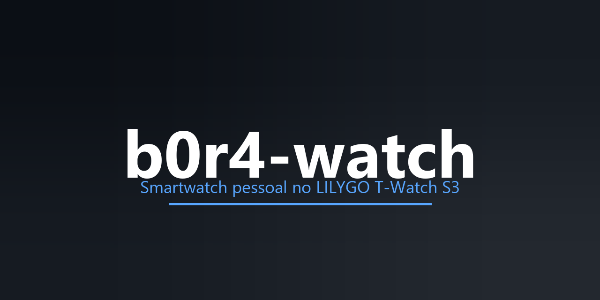

<p align="center">
  
</p>

<p align="center">
  <a href="https://github.com/leonardobora/b0r4-watch/stargazers"></a>
  <a href="https://github.com/leonardobora/b0r4-watch/blob/main/LICENSE"></a>
  <a href="https://github.com/leonardobora/b0r4-watch/issues"></a>
  <a href="https://github.com/leonardobora/b0r4-watch/pulls"></a>
  <a href="https://github.com/leonardobora/b0r4-watch/commits"></a>
</p>

<p align="center">
  <b>Smartwatch pessoal no LILYGO T-Watch S3</b><br>
  <sub>Firmware ESP32/LVGL + servidor-agente Python (FastAPI) no pulso.</sub>
</p>

---

Smartwatch pessoal construído no **LILYGO T-Watch S3 (SX1262 915MHz)** com firmware ESP32 + servidor-agente Python.

## O que é

Duas pernas independentes:

- **`firmware/`** — Arduino + PlatformIO, LVGL, rodando no T-Watch S3.
- **`server/`** — Python (FastAPI + WebSocket + MQTT) para música (ytmusicapi), IA híbrida (ASR/LLM/TTS) e integrações.

## Decisões já tomadas

- **Hardware:** T-Watch S3, SX1262 915MHz
- **Toolchain:** Arduino + PlatformIO (lib oficial `t-watch-s3`)
- **IA:** híbrido 3 camadas — WakeNet9 (gatilho) + MultiNet (offline) + servidor cloud
- **Notificações:** ANCS via BLE do iPhone 13 (bots fora do escopo agora)
- **Casa:** Home Assistant + ESPHome (luzes na tela)
- **Energia:** BLE ativo + wake word sob demanda
- **Temas:** SquareLine Studio + gestos touch
- **Input:** gestos (BMA423) + botão POWER + touch, sem always-on — veja `docs/input-system.md`
- **Assistente:** pipeline ASR → LLM → TTS via WebSocket, com providers configuráveis — veja `server/README.md`

Veja `docs/adr/` para decisões arquiteturais, `docs/CONTEXT.md` para o glossário, `docs/input-system.md` para o sistema de input e `server/README.md` para o assistente.

## Avatar (Fase 0)

O firmware já tem um avatar ASCII animado na tela, inspirado no StackChan (M5Stack):

- **7 emoções:** `NEUTRAL`, `HAPPY`, `ANGRY`, `SAD`, `SURPRISED`, `SLEEPY`, `DOUBT`.
- **Modifiers:** `BlinkModifier` (piscada a cada ~5,2 s) e `BreathModifier` (movimento vertical suave de ~6 s).
- **Demo:** a face atualiza a ~30 FPS e muda de emoção a cada 3 s.

Código em `firmware/src/avatar/`; decisão arquitetural em `docs/adr/0008-avatar.md`.

## Estrutura

```
b0r4-watch/
├── firmware/     # PlatformIO T-Watch S3
├── server/       # Python FastAPI
└── docs/         # ADRs e glossário
```

## Milestones

1. **Setup (Fase 0)** — estrutura, compilar sem placa, avatar ASCII animado
2. **Bare metal** — flash, tela, RTC, sleep
3. **LVGL launcher + temas**
4. **ANCS (iPhone)**
5. **Música** (ytmusicapi + media keys + A2DP)
6. **Casa** (ESPHome/HA)
7. **IA híbrida**
8. **Hacker** (IR, LoRa, Wi-Fi scan)
9. **Futuro:** GPS shield, wake word always-on, TLS

## Requisitos

- Python 3.12+
- PlatformIO Core (`pip install platformio`)
- VS Code + extensão PlatformIO IDE (recomendado)

## Como começar

### Firmware

```bash
cd firmware
pio run
```

### Servidor

```bash
cd server
python -m venv .venv
.venv\Scripts\activate
pip install -r requirements.txt
copy env.example .env
uvicorn main:app --reload
```

## Licença

[MIT](LICENSE)
