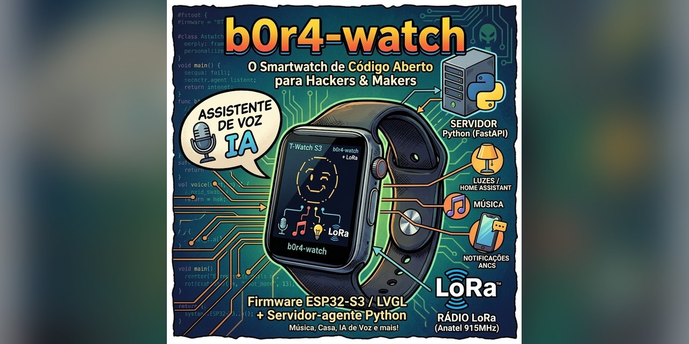
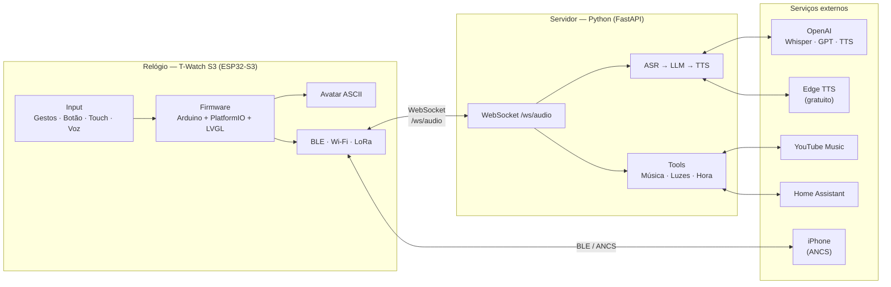
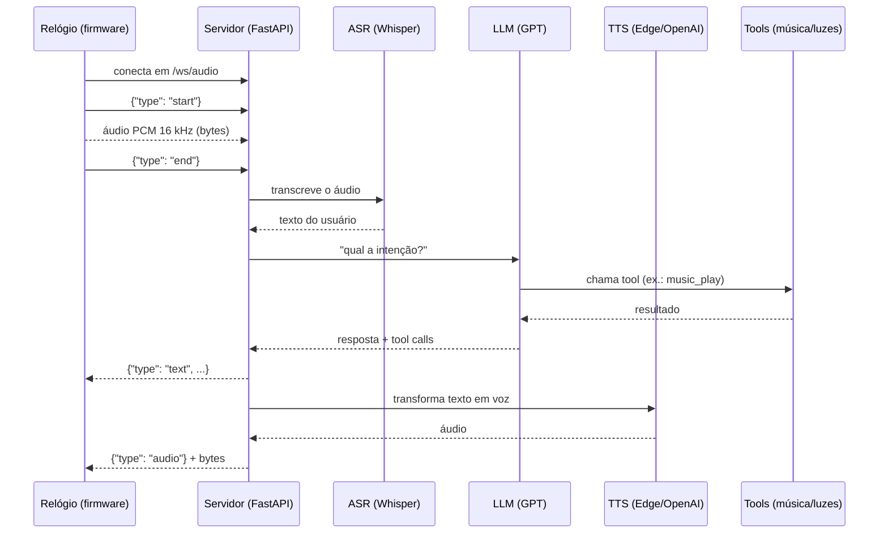
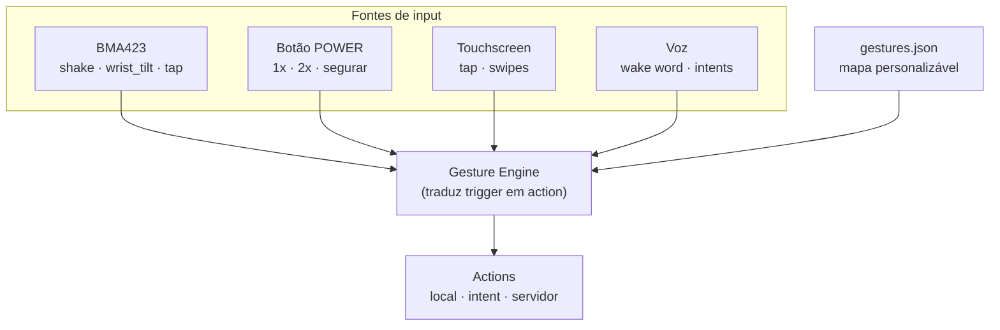

<p align="center">
  
</p>

<p align="center">
  <a href="https://github.com/leonardobora/b0r4-watch/stargazers"></a>
  <a href="https://github.com/leonardobora/b0r4-watch/blob/main/LICENSE"></a>
  <a href="https://github.com/leonardobora/b0r4-watch/issues"></a>
  <a href="https://github.com/leonardobora/b0r4-watch/pulls"></a>
  <a href="https://github.com/leonardobora/b0r4-watch/commits"></a>
  <a href="https://img.shields.io/github/languages/top/leonardobora/b0r4-watch"></a>
  <a href="https://img.shields.io/github/repo-size/leonardobora/b0r4-watch"></a>
</p>

<p align="center">
  <b>Um smartwatch pessoal de código aberto, construído do zero no LILYGO T-Watch S3.</b><br>
  <sub>Firmware ESP32/LVGL no pulso + servidor-agente Python (FastAPI) com IA de voz, música e automação de casa.</sub>
</p>

---

## O que é isso? (para todo mundo)

Um **smartwatch que você mesmo constrói e programa**. Em vez de comprar um relógio pronto com um sistema fechado, este projeto usa uma placa de hardware aberta chamada **LILYGO T-Watch S3** — um pequeno computador com tela touch, acelerômetro, microfone, Bluetooth, Wi-Fi e rádio LoRa — e um software escrito aqui mesmo, em duas partes que conversam entre si:

1. **O "cérebro" do relógio** (`firmware/`) — o programa que roda na placa e controla a tela, os sensores e o que aparece no pulso.
2. **Um "assistente" em casa** (`server/`) — um programa Python que roda no seu computador ou servidor e dá poderes extras ao relógio: entender sua voz, tocar música, controlar luzes e responder perguntas com IA.

No estado atual, o relógio **já exibe um rosto animado (avatar) na tela**, e o servidor **já roda um assistente de voz completo** (ouvir → pensar → responder em áudio). O resto — notificações do iPhone, música, automação de casa, rádio LoRa — está planejado e documentado nos próximos passos.

> Tudo aqui é **aberto e feito à mão**: sem apps proprietários, sem nuvem obrigatória, sem caixa-preta. Ideal para aprender, hackear e personalizar.

---

## Funcionalidades

Status: ✅ **Implementado** · 🚧 **Em andamento** · 📐 **Projetado (documentado)** · 🔮 **Futuro**

| Funcionalidade | Para todo mundo | Detalhe técnico | Status |
|---|---|---|---|
| **Avatar animado** | Um rostinho ASCII que pisca, respira e muda de emoção na tela | Sistema `Avatar` em LVGL com 7 emoções, `BlinkModifier` e `BreathModifier`, ~30 FPS | ✅ `firmware/src/avatar/` |
| **Assistente de voz** | Fale com o relógio: ele transcreve, pensa e responde em áudio | Pipeline `ASR → LLM → TTS` via WebSocket, com providers configuráveis | ✅ `server/` |
| **Comandos por voz** | "Toca uma música", "apaga a luz da sala", "que horas são" | Tool calls do LLM: `music_play`, `music_next`, `music_pause`, `lights_toggle`, `system_time` | ✅ `server/src/tools.py` |
| **Controle de música** | Pedir música pelo nome, pular faixa, pausar | Integração com YouTube Music (`ytmusicapi`) + media keys do PC | 🚧 stubs prontos, integração real no roadmap |
| **Luzes e casa inteligente** | Acender/apagar luzes de um cômodo pela voz | Integração com Home Assistant / ESPHome | 🚧 stub pronto, integração no roadmap |
| **Sistema de input** | Controlar o relógio com gestos, botão, toque e voz | `GestureEngine` traduz *triggers* (shake, double-click, swipe, wake word) em *actions*, mapeadas em `gestures.json` | 📐 `docs/input-system.md` + ADR 0007 |
| **Notificações do iPhone** | Alertas do WhatsApp, ligações e apps no pulso | Protocolo ANCS (Apple Notification Center Service) via BLE | 🔮 ADR 0006 |
| **Rádio LoRa** | Comunicar com outros dispositivos de longa distância, sem internet | Rádio SX1262 915 MHz (faixa Anatel), compatível com Meshtastic | 🔮 ADR 0002 |
| **Temas e launcher** | Trocar visual da tela e navegar entre apps | UI em LVGL, temas criados no SquareLine Studio | 🔮 roadmap |
| **GPS** | Localização e tracking | Shield GPS + `TinyGPSPlus` | 🔮 roadmap |

---

## Arquitetura

Duas pernas independentes que conversam por WebSocket:



- **`firmware/`** — Arduino + PlatformIO, LVGL, rodando no T-Watch S3 (SX1262 915 MHz). Já compila sem placa: **RAM 7.3% / Flash 21.2%**.
- **`server/`** — Python (FastAPI + WebSocket + MQTT) para música (ytmusicapi), IA híbrida (ASR/LLM/TTS) e integrações. Pode rodar no mesmo PC ou num servidorzinho em casa.
- **`docs/`** — ADRs (decisões arquiteturais) e glossário de termos do projeto.

Decisões principais registradas em `docs/adr/`:

| Decisão | Escolha | ADR |
|---|---|---|
| Toolchain do firmware | Arduino + PlatformIO (lib oficial `t-watch-s3`) | [0001](docs/adr/0001-toolchain.md) |
| Variante de hardware | SX1262 915 MHz (Anatel, Meshtastic) | [0002](docs/adr/0002-hardware-variant.md) |
| Arquitetura | Duas pernas: firmware + servidor reutilizável | [0003](docs/adr/0003-architecture.md) |
| Estratégia de IA | Híbrido 3 camadas: WakeNet9 + MultiNet + cloud | [0004](docs/adr/0004-ai-strategy.md) |
| Energia | BLE ativo, Wi-Fi sob demanda, deep sleep | [0005](docs/adr/0005-energy.md) |
| Notificações | Somente ANCS via BLE do iPhone | [0006](docs/adr/0006-notifications.md) |
| Sistema de input | Gestos + botão + touch + voz, sem always-on | [0007](docs/adr/0007-input-system.md) |
| Avatar | Rosto ASCII em LVGL, leve e extensível | [0008](docs/adr/0008-avatar.md) |

---

## Como o assistente de voz funciona

O relógio grava sua voz, envia pela rede e o servidor devolve a resposta falada:



**Providers configuráveis** (via `.env`, sem recompilar):

| Etapa | Providers | Padrão |
|---|---|---|
| ASR | `openai` (Whisper), `mock` | `mock` |
| LLM | `openai` (GPT), `mock` | `mock` |
| TTS | `openai`, `edge_tts` (gratuito), `mock` | `mock` |

O modo `mock` permite testar o fluxo inteiro **sem gastar nada** — ideal para desenvolver sem o relógio físico.

---

## Como você controla o relógio

O sistema de input foi desenhado para ser **econômico e intencional** — nada de sensores "sempre ouvindo" que drenam a bateria. O usuário dispara ações com gestos claros:



Exemplos do mapeamento de fábrica: levantar o pulso acorda a tela, chacoalhar 2× pro lado abre o assistente, duplo clique no POWER pula a música. O mapa completo vive em `gestures.json` — dá para trocar os atalhos **sem recompilar o firmware** (útil para versões white-label). Veja `docs/input-system.md`.

---

## Roadmap

| # | Milestone | Descrição | Status |
|---|---|---|---|
| 1 | **Setup (Fase 0)** | Estrutura do projeto, compilar sem placa, avatar ASCII animado | ✅ |
| 2 | **Bare metal** | Flash, tela, RTC, sleep | 🔮 |
| 3 | **LVGL launcher + temas** | Menu de apps e temas visuais (SquareLine Studio) | 🔮 |
| 4 | **ANCS (iPhone)** | Notificações do iPhone via BLE | 🔮 |
| 5 | **Música** | ytmusicapi + media keys + A2DP | 🔮 |
| 6 | **Casa** | ESPHome / Home Assistant | 🔮 |
| 7 | **IA híbrida** | WakeNet9 (sempre ligado) + MultiNet (offline) + cloud | 🔮 |
| 8 | **Hacker** | IR, LoRa, Wi-Fi scan | 🔮 |
| 9 | **Futuro** | GPS shield, wake word always-on, TLS | 🔮 |

---

## Estrutura do repositório

```
b0r4-watch/
├── firmware/                  # Plataforma T-Watch S3 (Arduino + PlatformIO + LVGL)
│   ├── src/
│   │   ├── avatar/            # sistema de avatar ASCII (7 emoções + modifiers)
│   │   │   └── modifiers/     # BlinkModifier, BreathModifier
│   │   └── main.cpp           # entry point + demo do avatar
│   ├── boards/                # definição da placa LilyGoWatch-S3
│   └── platformio.ini
├── server/                    # Servidor-agente Python (FastAPI + WebSocket + MQTT)
│   ├── main.py                # endpoints REST + WebSocket /ws/audio
│   ├── src/
│   │   ├── asr.py             # reconhecimento de fala (openai | mock)
│   │   ├── llm.py             # LLM com tool calling (openai | mock)
│   │   ├── tts.py             # síntese de voz (openai | edge_tts | mock)
│   │   ├── music.py           # controle de música (ytmusicapi)
│   │   ├── lights.py          # luzes / Home Assistant
│   │   └── tools.py           # definição das tools do assistente
│   └── scripts/test_client.py # teste do pipeline sem o relógio
└── docs/
    ├── adr/                   # decisões arquiteturais (0001..0008)
    ├── CONTEXT.md             # glossário de termos do projeto
    └── input-system.md        # design do sistema de input
```

---

## Como começar

### Firmware

```bash
cd firmware
pio run
```

A primeira execução baixa as dependências (~500 MB) e compila o ESP32 Arduino core. Com o relógio em modo download (segure BOOT, aperte RST, solte BOOT):

```bash
pio run --target upload
pio device monitor
```

### Servidor

```bash
cd server
python -m venv .venv
.venv\Scripts\activate
pip install -r requirements.txt
copy env.example .env   # preencha as chaves que quiser usar
uvicorn main:app --reload
```

O endpoint `/health` responde em http://localhost:8000/health.

### Testar o assistente sem o relógio

```bash
# terminal 1 — servidor
uvicorn main:app --reload

# terminal 2 — cliente de teste (envia 1 s de silêncio e mostra a resposta do pipeline)
python scripts/test_client.py
```

---

## Documentação

- **Decisões arquiteturais:** `docs/adr/` (toolchain, hardware, arquitetura, IA, energia, notificações, input, avatar)
- **Glossário:** `docs/CONTEXT.md` — termos do projeto em linguagem ubíqua
- **Sistema de input:** `docs/input-system.md`
- **Servidor:** `server/README.md` — protocolo WebSocket e providers

## Requisitos

- Python 3.12+
- PlatformIO Core (`pip install platformio`)
- VS Code + extensão PlatformIO IDE (recomendado)

## Licença

[MIT](LICENSE)